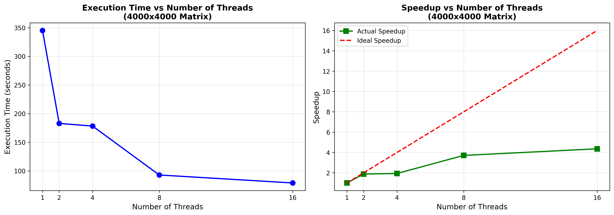

# Matrix Multiplication

## Sequential Matrix Multiplication

The sequential matrix multiplication was implemented using the standard triple-loop approach where each element of the result matrix is computed by taking the dot product of the corresponding row from matrix A and column from matrix B. The method was validated by manually creating two small 2x2 test matrices with known values and verifying that the output matched the hand-calculated result. This process was repeated with different matrix sizes to confirm correctness.

## Parallel Matrix Multiplication

The parallel matrix multiplication divides the work by assigning different rows of the result matrix to different threads. The result matrix is divided into equal chunks of rows, where each thread computes approximately `rowsA / NUMBER_THREADS` rows. The last thread handles any remaining rows if the division is not exact. Each thread independently computes its assigned rows using the standard triple-loop algorithm, and since each thread writes to distinct rows of the result matrix, no synchronization is needed. After all threads are created and started, the main thread uses `join()` to wait for all worker threads to complete before returning the result. The method was validated by comparing the output of the parallel implementation against the sequential implementation for the same input matrices and verifying that all corresponding elements match within a small tolerance.

## Execution Time Measurement

The `measureExecutionTime()` method measures the execution time for both sequential and parallel matrix multiplication by recording the system time before and after each multiplication using `System.currentTimeMillis()`. The method displays the execution times, calculates the speedup ratio, and validates that both implementations produce identical results. To test the method returns plausible results, we verify that: (1) the sequential time is consistently longer than the parallel time for large matrices, (2) the speedup is reasonable and less than or equal to the number of threads used, and (3) both methods produce matching results, confirming correctness. Running the method multiple times with different matrix sizes should show that larger matrices benefit more from parallelization.

## Performance Analysis with Varying Thread Counts

Experiments were conducted with 4000x4000 matrices using thread counts of 1, 2, 4, 8, and 16. The results show that execution time decreases as the number of threads increases, with the most significant improvements occurring between 1 and 8 threads. The speedup shows sub-linear scaling due to overhead from thread creation, management, and potential resources contention.

| Number of Threads | Execution Time (ms) | Execution Time (s) | Speedup |
|-------------------|--------------------:|-------------------:|--------:|
| Sequential        | 344,146            | 344.1              | 1.00x   |
| 1                 | 345,096            | 345.1              | 1.00x   |
| 2                 | 182,927            | 182.9              | 1.88x   |
| 4                 | 178,287            | 178.3              | 1.93x   |
| 8                 | 92,857             | 92.9               | 3.71x   |
| 16                | 78,945             | 78.9               | 4.36x   |

With 1 thread, the parallel implementation performs similarly to sequential (1.00x speedup). Using 2 threads achieves 1.88x speedup, while 4 threads gives 1.93x, indicating diminishing returns likely due to the system having 4 physical cores. At 8 threads, speedup improves to 3.71x as hyperthreading is utilized, and 16 threads achieves 4.36x speedup. The speedup does not scale linearly with thread count because of overhead costs, memory bandwidth limitations, and cache contention. The plot clearly shows that beyond the number of physical cores, adding more threads provides reduced benefit due to these factors.



## Performance Comparison Across Matrix Sizes

Experiments were conducted with matrix sizes ranging from 100x100 to 4000x4000, comparing sequential execution against parallel execution using 16 threads (the optimal thread count from 1.4). The results demonstrate that execution time grows cubically with matrix size for both approaches, as expected for O(n³) algorithms.

| Matrix Size | Sequential Time (ms) | Parallel Time (ms) | Speedup |
|------------:|---------------------:|-------------------:|--------:|
| 100x100     | 5                   | 16                 | 0.31x   |
| 200x200     | 29                  | 6                  | 4.83x   |
| 500x500     | 116                 | 31                 | 3.74x   |
| 1000x1000   | 1,224               | 280                | 4.37x   |
| 2000x2000   | 17,229              | 4,256              | 4.05x   |
| 3000x3000   | 93,898              | 22,406             | 4.19x   |
| 4000x4000   | 256,904             | 64,079             | 4.01x   |

For very small matrices (100x100), the parallel implementation is actually slower than sequential due to thread creation overhead outweighing the computational benefit. However, as matrix size increases, the parallel approach consistently achieves approximately 4x speedup. The speedup stabilizes around 4-4.3x for larger matrices (200x200 and above), which aligns with the theoretical maximum speedup limited by available hardware resources. The plot clearly illustrates that while both methods show exponential growth in execution time as matrix size increases, the parallel implementation maintains a consistent performance advantage for matrices larger than 100x100.


## Analysis of Graph Shapes and Observed Behavior

**1.4 (Threads vs Performance):** The execution time plot shows a decreasing curve that becomes flatter as thread count increases, demonstrating diminishing returns. The speedup plot shows sub-linear growth that diverges from the ideal linear speedup line. This behavior occurs because: (1) thread creation and management overhead becomes more significant with more threads, (2) the system has limited physical cores (likely 4-8), so additional threads must share resources through hyperthreading which provides limited benefit, (3) memory bandwidth becomes a bottleneck as multiple threads compete to access the same matrices, and (4) cache contention increases as threads compete for shared cache resources. The flattening of the curve suggests that beyond 8 threads, the overhead of managing additional threads nearly equals the computational benefit gained.

**1.5 (Matrix Size vs Performance):** Both sequential and parallel execution times follow an exponential growth pattern on the log-scale plot, reflecting the O(n³) time complexity of matrix multiplication. The parallel line is consistently below the sequential line (except for 100x100) and maintains a roughly constant vertical distance, indicating consistent speedup across matrix sizes. The shape demonstrates that: (1) computational work grows cubically with matrix size since each element requires n multiplications and there are n² elements, (2) larger matrices provide more work to distribute among threads, making parallelization more effective, (3) the constant gap between lines shows that parallel overhead becomes negligible relative to computation time for larger matrices, and (4) the crossover point at small matrix sizes reveals where overhead dominates, making parallelization counterproductive. The log scale clearly visualizes the dramatic increase in execution time as matrices grow larger.

# Deadlock

## Deadlock Conditions and Demonstration

Deadlock occurs when four conditions are simultaneously satisfied: (1) **Mutual Exclusion** - resources cannot be shared and only one thread can use a resource at a time, (2) **Hold and Wait** - threads hold resources while waiting for additional resources, (3) **No Preemption** - resources cannot be forcibly taken from threads, and (4) **Circular Wait** - a circular chain exists where each thread waits for a resource held by the next thread in the chain. The consequences of deadlock are severe: the involved threads become permanently blocked and unable to progress, system resources remain locked and unavailable, and the application may hang indefinitely requiring manual intervention to terminate.

The `DeadlockDemo.java` program demonstrates deadlock using two threads and two shared resources. Thread 1 acquires a lock on Resource A and then attempts to acquire Resource B, while Thread 2 acquires a lock on Resource B and then attempts to acquire Resource A. The sleep delays ensure both threads acquire their first lock before attempting the second. This creates a circular wait: Thread 1 holds A and waits for B, while Thread 2 holds B and waits for A. Since both threads are waiting for resources held by the other and neither can proceed, the program hangs indefinitely. Running the program shows both threads acquiring their first lock and then waiting forever for their second lock, clearly demonstrating the deadlock condition.

## Deadlock Prevention Solutions

Several design solutions can prevent deadlock by breaking one of the four necessary conditions. **Lock Ordering** establishes a global order for acquiring locks, ensuring all threads request resources in the same sequence, thereby breaking circular wait. **Lock Timeout** uses timed lock attempts where threads release held locks if they cannot acquire all needed resources within a timeout period, breaking the hold-and-wait condition. **Deadlock Detection and Recovery** allows the system to detect deadlock cycles and recover by forcibly releasing locks or terminating threads. **Resource Allocation Graph** prevents cycles by analyzing resource dependencies before granting locks. **Single Lock Strategy** uses one global lock for all operations, eliminating the possibility of circular wait but reducing concurrency.

For the `DeadlockDemo.java` program, the **lock ordering** solution is most appropriate and straightforward to implement. By ensuring both threads acquire locks in the same order (always lock A before B), the circular wait condition is eliminated. Thread 1 would lock A then B, and Thread 2 would also lock A then B, meaning Thread 2 would wait for Thread 1 to release A, then proceed to acquire both locks in sequence. This simple modification guarantees deadlock cannot occur while maintaining the same functionality. Alternatively, **lock timeout** could be used where threads attempt to acquire locks with a timeout and retry if unsuccessful, though this adds complexity and potential performance overhead from repeated attempts.

# Dining Philosophers

## Dining Philosophers with Deadlock

The `DiningPhilosophers.java` program simulates the classic dining philosophers problem for any number n of philosophers. Each philosopher is implemented as a thread that continuously alternates between thinking and eating. To eat, a philosopher must acquire two chopsticks - the one on their left and the one on their right. The chopsticks are represented as shared `Object` instances stored in an array, where philosopher i uses chopstick i (left) and chopstick (i+1) % n (right).

**Preventing Simultaneous Chopstick Access:** The program uses Java's `synchronized` keyword to ensure mutual exclusion. When a philosopher attempts to pick up a chopstick, they must acquire the lock on that chopstick object using a synchronized block. Since only one thread can hold a lock on an object at any given time, this guarantees that two philosophers cannot hold the same chopstick simultaneously. The nested synchronized blocks ensure that a philosopher holds the left chopstick while attempting to acquire the right chopstick.

**Why Deadlock is Possible:** Deadlock occurs when all philosophers simultaneously pick up their left chopstick and then wait for their right chopstick, which is held by their neighbor. This creates a circular wait condition: Philosopher 0 holds chopstick 0 and waits for chopstick 1, Philosopher 1 holds chopstick 1 and waits for chopstick 2, and so on, until Philosopher n-1 holds chopstick n-1 and waits for chopstick 0 (held by Philosopher 0). Since each philosopher refuses to release their left chopstick until they acquire their right chopstick, and all right chopsticks are held by neighbors, the system deadlocks. The sleep delay after picking up the left chopstick increases the likelihood of this scenario occurring, as it gives all philosophers time to acquire their left chopstick before any can proceed to acquire their right chopstick.

**Sample Output:**
```
Philosopher 0 is thinking
Philosopher 1 is thinking
Philosopher 2 is thinking
Philosopher 3 is thinking
Philosopher 4 is thinking
Philosopher 2 picked up left chopstick
Philosopher 4 picked up left chopstick
Philosopher 0 picked up left chopstick
Philosopher 1 picked up left chopstick
Philosopher 2 picked up right chopstick
Philosopher 2 is eating (meal #1)
Philosopher 2 finished eating and put down chopsticks
Philosopher 2 is thinking
Philosopher 1 picked up right chopstick
Philosopher 1 is eating (meal #1)
Philosopher 3 picked up left chopstick
Philosopher 1 finished eating and put down chopsticks
...
[Program continues with philosophers eating successfully]
...
Philosopher 3 picked up left chopstick
Philosopher 4 picked up left chopstick
[All 5 philosophers now holding their left chopstick - DEADLOCK]
[Program hangs indefinitely as each waits for their right chopstick]
```

The output demonstrates that philosophers successfully think and eat for several rounds, but eventually reach a state where all simultaneously hold their left chopstick and wait indefinitely for their right chopstick, causing deadlock.

## Dining Philosophers with Deadlock Prevention

The modified program prevents deadlock by implementing **resource ordering** (also known as the lock ordering strategy). Instead of each philosopher always picking up their left chopstick first and then their right chopstick, philosophers now acquire chopsticks in a globally consistent order based on chopstick IDs. Specifically, each philosopher determines which of their two adjacent chopsticks has the lower ID number and always acquires that one first, then acquires the higher-numbered chopstick second.

**How This Prevents Deadlock:** This approach breaks the circular wait condition, which is one of the four necessary conditions for deadlock. In the original deadlocked version, Philosopher 4 would pick up chopstick 4 first and then try to get chopstick 0, while Philosopher 0 would pick up chopstick 0 first and then try to get chopstick 1, creating a potential circular dependency (0→1, 1→2, 2→3, 3→4, 4→0). With resource ordering, Philosopher 4 now picks up chopstick 0 first (lower ID) and then chopstick 4 (higher ID), matching the same order as Philosopher 0. This means Philosopher 4 competes with Philosopher 0 for chopstick 0 rather than creating a circular wait. Since all philosophers now acquire resources in ascending order, no circular wait can form, and deadlock is impossible.

**Starvation Possibility:** Yes, starvation is still possible even though deadlock is prevented. Starvation occurs when a thread is perpetually denied access to a resource it needs because other threads continually acquire that resource. In this implementation, a philosopher could theoretically starve if they are consistently unlucky in acquiring their first chopstick - other philosophers might repeatedly acquire and release the chopsticks while this philosopher never gets a chance. For example, if Philosophers 0 and 4 both need chopstick 0 as their first chopstick, and one of them consistently wins the lock while the other waits, the waiting philosopher could starve. This is because Java's `synchronized` keyword does not guarantee fairness - it doesn't enforce a first-come-first-served order for threads waiting on a lock. The JVM scheduler could repeatedly give priority to certain threads over others, leading to starvation of less fortunate threads.

**Sample Output:**
```
Philosopher 0 is thinking
Philosopher 1 is thinking
...
Philosopher 2 picked up chopstick 2
Philosopher 2 picked up chopstick 3
Philosopher 2 is eating (meal #1)
Philosopher 4 picked up chopstick 0
Philosopher 4 picked up chopstick 4
Philosopher 4 is eating (meal #1)
...
[Philosophers continue eating indefinitely without deadlock]
Philosopher 0 is eating (meal #30)
Philosopher 1 is eating (meal #33)
Philosopher 2 is eating (meal #37)
Philosopher 3 is eating (meal #40)
Philosopher 4 is eating (meal #35)
```

The output shows philosophers successfully completing many meals without ever entering a deadlock state.

## Dining Philosophers with Starvation Prevention

The final version of the program prevents both deadlock and starvation by replacing `synchronized` blocks with fair `ReentrantLock` objects. A fair lock guarantees that threads acquire the lock in First-In-First-Out (FIFO) order based on the time they requested it, rather than allowing the scheduler to arbitrarily select which waiting thread gets the lock next.

**Solution to Avoid Starvation:** The program uses `new ReentrantLock(true)` where the boolean parameter `true` enables fairness. When a philosopher tries to acquire a chopstick that is currently held by another philosopher, they join a queue. Fair locks ensure that when the chopstick becomes available, it is given to the philosopher who has been waiting longest, not to a philosopher who just arrived. This prevents the scenario where an unlucky philosopher might perpetually lose the race for chopsticks to faster or more fortunate threads. Combined with resource ordering (which prevents deadlock), this guarantees that every philosopher will eventually get both chopsticks they need to eat.

**Testing for Starvation-Freedom:** We can test that the solution is starvation-free by running the program for an extended period and monitoring the meal count for each philosopher. In a starvation-free system, all philosophers should eat a roughly comparable number of meals over time - no philosopher should have a meal count dramatically lower than the others. We can observe from the output that meal counts remain balanced:

**Sample Output:**
```
...
Philosopher 0 is eating (meal #45)
Philosopher 1 is eating (meal #50)
Philosopher 2 is eating (meal #52)
Philosopher 3 is eating (meal #59)
Philosopher 4 is eating (meal #42)
...
```

After running for several seconds, all philosophers have eaten between 42-59 meals, showing relatively balanced progress. In contrast, a system with starvation might show one philosopher at meal #2 while others are at meal #50+. The fair locks guarantee that no philosopher is indefinitely prevented from eating, thus proving the system is starvation-free. We could also add logging to track wait times and verify that no philosopher waits an unbounded amount of time for resources.

# Amdahl's Law

## Speedup Calculation with 40% Sequential Execution

Let's consider a program where 40% of the execution time is sequential ($s = 0.40$) and 60% can be parallelized ($p = 0.60$). We want to find the speedup formula and maximum achievable speedup.

By Amdahl's Law, the speedup $S(n)$ with $n$ processors is defined as the ratio of sequential execution time to parallel execution time:

$$S(n) = \frac{T(1)}{T(n)}$$

To derive this, let's normalize the sequential execution time $T(1) = 1$. When we use $n$ processors, the execution time becomes:

$$T(n) = s + \frac{p}{n}$$

This is because the sequential portion $s$ cannot be parallelized and still takes the same time, while the parallel portion $p$ is divided among $n$ processors.

Substituting our values:
$$T(n) = 0.40 + \frac{0.60}{n}$$

Therefore, the speedup is:
$$S(n) = \frac{1}{0.40 + \frac{0.60}{n}}$$

To find the maximum speedup as $n$ approaches infinity:
$$\lim_{n \to \infty} S(n) = \lim_{n \to \infty} \left[\frac{1}{0.40 + \frac{0.60}{n}}\right] = \frac{1}{0.40} = 2.5$$

This shows that regardless of how many processors we add, we can never achieve more than 2.5× speedup due to the sequential bottleneck.

## Finding the Improvement Factor to Double Speedup

Consider a program with 30% sequential execution ($s = 0.30$) and 70% parallel execution ($p = 0.70$). We want to determine by what factor $k$ we need to improve the sequential portion to double the speedup on $n$ processors.

First, let's find the original speedup:
$$S_{\text{original}}(n) = \frac{1}{0.30 + \frac{0.70}{n}}$$

If we improve the sequential portion by factor $k$, the new sequential fraction becomes $s' = \frac{0.30}{k}$, and the parallel fraction becomes $p' = 1 - \frac{0.30}{k}$.

The new speedup is:
$$S_{\text{new}}(n) = \frac{1}{\frac{0.30}{k} + \frac{\left(1 - \frac{0.30}{k}\right)}{n}}$$

We want $S_{\text{new}}(n) = 2 \times S_{\text{original}}(n)$, so:
$$\frac{1}{\frac{0.30}{k} + \frac{\left(1 - \frac{0.30}{k}\right)}{n}} = \frac{2}{0.30 + \frac{0.70}{n}}$$

Cross-multiplying:
$$0.30 + \frac{0.70}{n} = 2\left[\frac{0.30}{k} + \frac{\left(1 - \frac{0.30}{k}\right)}{n}\right]$$

Expanding the right side:
$$0.30 + \frac{0.70}{n} = \frac{0.60}{k} + \frac{2\left(1 - \frac{0.30}{k}\right)}{n}$$
$$0.30 + \frac{0.70}{n} = \frac{0.60}{k} + \frac{2}{n} - \frac{0.60}{kn}$$

Multiplying through by $kn$:
$$0.30kn + 0.70k = 0.60n + 2k - 0.60$$
$$0.30kn + 0.70k - 2k = 0.60n - 0.60$$
$$k(0.30n - 1.30) = 0.60(n - 1)$$

Therefore:
$$k = \frac{0.60(n - 1)}{0.30n - 1.30} = \frac{6(n - 1)}{3n - 13}$$

For example, with $n = 10$ processors: $k = \frac{6(9)}{17} \approx 3.18$, meaning we need to reduce the sequential portion to about 1/3 of its original time.

## Finding Sequential Fraction Given Improvement and Speedup

We're told that when the sequential time is decreased by a factor of 3, the modified program takes half the time of the original on $n$ processors. We need to find the original sequential fraction $s$.

Let's set up the problem. Originally, with sequential fraction $s$, the execution time on $n$ processors is:
$$T_{\text{original}}(n) = s + \frac{1-s}{n}$$

After improvement, the sequential portion becomes $\frac{s}{3}$, so the new execution time is:
$$T_{\text{modified}}(n) = \frac{s}{3} + \frac{\left(1-\frac{s}{3}\right)}{n} = \frac{s}{3} + \frac{3-s}{3n}$$

We're given that $T_{\text{modified}}(n) = \frac{1}{2} \times T_{\text{original}}(n)$, so:
$$\frac{s}{3} + \frac{3-s}{3n} = \frac{1}{2}\left[s + \frac{1-s}{n}\right]$$

Let's solve this equation. Multiplying both sides by $6n$:
$$2ns + 2(3-s) = 3ns + 3(1-s)$$
$$2ns + 6 - 2s = 3ns + 3 - 3s$$

Rearranging:
$$2ns - 3ns - 2s + 3s = 3 - 6$$
$$-ns + s = -3$$
$$s(1-n) = -3$$
$$s = \frac{3}{n-1}$$

We can verify this makes sense: for $n = 4$, $s = 1$ (100% sequential), which represents an edge case. For larger $n$, $s$ becomes a reasonable fraction. For instance, with $n = 10$, $s = \frac{3}{9} = \frac{1}{3}$, meaning 33% of the program is sequential.
